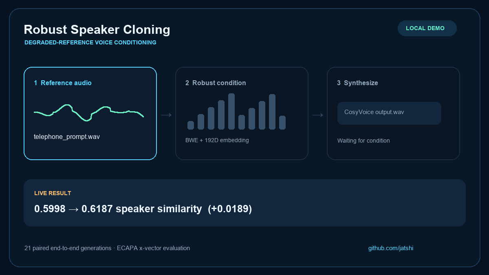
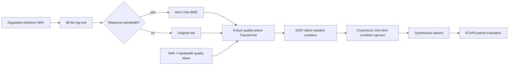

# Robust Speaker Cloning

<p align="center">
  <strong>Robust reference conditioning for zero-shot CosyVoice cloning under noisy, reverberant and telephone prompts.</strong><br />
  A compact Transformer + bandwidth-extension front end, evaluated through real end-to-end synthesis.
</p>

<p align="center">
  <a href="https://huggingface.co/jatshi/robust-speaker-cloning"></a>
  
  
  
</p>



> The animation follows the local demo’s actual pipeline: degraded reference → quality-aware robust condition → real CosyVoice synthesis. The displayed aggregate metric is the measured ECAPA result from this release.

## What it solves

Zero-shot TTS is only as reliable as its reference condition. A narrow-band phone prompt, background noise or reverberation can distort that condition before the TTS model ever starts decoding. This project freezes CosyVoice2-0.5B and learns a small, compatible front end that turns degraded reference mel features into a robust 192-dimensional speaker condition.

The project includes a telephone-only mel-domain BWE route, quality-adaptive Transformer conditioning, contrastive identity learning and distillation to CosyVoice’s frozen CampPlus reference interface.

## End-to-end result

| Metric, 21 paired generations | Baseline | Robust V2 | Delta |
| --- | ---: | ---: | ---: |
| ECAPA x-vector similarity to clean reference | 0.5998 | 0.6187 | **+0.0189** |

The average result is positive. However, the small evaluation contains negative deltas for HVAC noise and reverb, so this release does **not** claim universal improvement. See [`results/evaluation.csv`](results/evaluation.csv) for every paired measurement.

## Architecture



## Feature matrix

| Capability | Included |
| --- | :---: |
| 400-speaker AISHELL construction | ✓ |
| Seven deterministic degradation families | ✓ |
| 6-layer Transformer speaker encoder | ✓ |
| Telephone BWE U-Net | ✓ |
| InfoNCE + interface distillation + BWE joint loss | ✓ |
| Actual CosyVoice condition injection | ✓ |
| ECAPA x-vector paired evaluation | ✓ |
| Local Gradio demo | ✓ |

## Quick start

```bash
git clone https://github.com/Jatshi/robust-speaker-cloning.git
cd robust-speaker-cloning
python -m venv .venv
.venv/Scripts/activate  # Linux/macOS: source .venv/bin/activate
pip install -r requirements.txt
```

Download `best.pt` from [Hugging Face](https://huggingface.co/jatshi/robust-speaker-cloning) into `outputs/checkpoints/`. Obtain CosyVoice2-0.5B and the upstream CosyVoice repository according to their licenses, then make them available as `models/CosyVoice2-0.5B/` and `CosyVoice/`.

```bash
python app.py
# Local demo listens on http://127.0.0.1:7861
```

For a full training run, prepare AISHELL and run:

```bash
export PYTHONPATH=$PWD
bash scripts/run_v2.sh
```

## Model files

Large assets are hosted in [jatshi/robust-speaker-cloning](https://huggingface.co/jatshi/robust-speaker-cloning).

| Artifact | Purpose |
| --- | --- |
| `best.pt` | Best validation V2 Transformer + BWE checkpoint. |
| `last.pt` | Final epoch checkpoint for continuation or comparison. |
| `robust-speaker-cloning-v2.tar.gz` | Complete reproducibility archive with generated audio and evaluation output. |
| `evaluation.csv` | 21 baseline/robust paired ECAPA measurements. |

## Training recipe

- AISHELL: 400 speakers, up to 15 clean utterances each, 6,000 source utterances.
- Training coverage: 7 degradations per utterance, 42,000 logical samples.
- Cache: 80×251 float16 mel features, avoiding online augmentation stalls without reducing coverage.
- Optimizer: AdamW, cosine learning-rate schedule, FP16 AMP, gradient clipping.
- Formal run: 20 epochs, batch size 16, 47,240 optimization steps.
- Model sizes: 4.97M-parameter encoder and 3.89M-parameter BWE.

## Edge AI & inference

The learned front end has under 9M parameters and operates on mel features, so it is much lighter than retraining the 0.5B TTS backbone. In deployment, retain the upstream CosyVoice runtime, load `best.pt`, estimate quality from the reference signal, apply BWE only to narrow-band prompts, then inject the 192D condition. The release’s `app.py` implements this path.

## Repository layout

```text
├── app.py                     # Gradio reference-to-speech demo
├── assets/readme/             # README demo animation
├── results/                   # Small, versioned evaluation summaries
├── scripts/run_v2.sh          # End-to-end training entry point
├── src/                       # Data, model, training, inference and evaluation
└── tests/                     # Shape, loss and degradation tests
```

## Git policy

- Source, tests, compact result tables and GIFs are tracked in Git.
- Checkpoints, mel caches, generated audio and archives live on Hugging Face.
- No credentials, user speech data or handover/interview documents are published.
- The repository uses an MIT code license; CosyVoice, CampPlus, ECAPA and AISHELL have independent upstream terms.

## Citation

Please cite the upstream [CosyVoice](https://github.com/FunAudioLLM/CosyVoice), [SpeechBrain](https://speechbrain.github.io/) and AISHELL-1 resources when using this work. A project-specific paper citation will be added when available.
