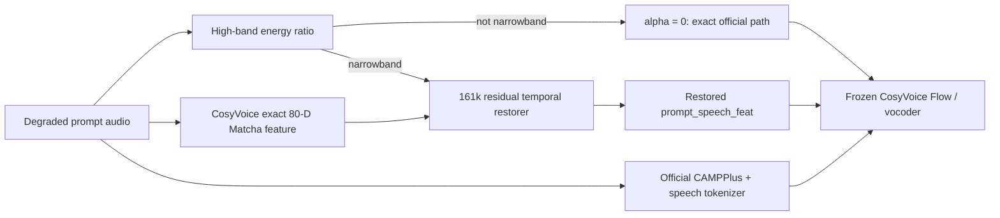

# Robust Speaker Cloning V4

<p align="center">
  <strong>Evidence-first narrowband prompt restoration for zero-shot CosyVoice cloning.</strong><br>
  Frozen CAMPPlus · frozen speech tokens · exact acoustic-prompt features · no-op safety router
</p>

<p align="center">
  <a href="https://huggingface.co/jatshi/robust-speaker-cloning"></a>
  
  
</p>


> **Evidence status (2026-09-03):** V4 has a complete AutoDL chain and a fresh-seed 105-pair confirmation run. The public Hugging Face link still identifies the earlier public weight release; do not describe it as the V4 checkpoint until the model card and weight are updated.

## Outcome

The original idea—training a small encoder from scratch to replace CAMPPlus—failed decisively. V3 reduced mean ECAPA speaker similarity by `-0.21257` on 105 paired generations. V4 instead freezes every mature CosyVoice component, diagnoses the actual conditioning bottleneck, restores only the 80-D acoustic prompt feature, and applies that restorer only to detected narrowband inputs.

On a new-random-seed confirmation protocol with 7 degradation families × 15 cases:

| Metric | Official degraded baseline | Routed V4 | Delta |
|---|---:|---:|---:|
| ECAPA cosine to independent clean reference | 0.61677 | 0.62233 | **+0.00556** |
| UTMOS22 strong | 2.63001 | 2.65358 | **+0.02357** |

The ECAPA 95% bootstrap CI is `[+0.00174,+0.00998]`; paired two-sided Wilcoxon `p=0.01759`. The router changed 15/105 cases—14 telephone and one low-high-band-energy Opus—and left the other 90 cases numerically on the official path.

This is evidence for a narrowband-safe route on one corpus and one held-out speaker pool, not a universal robustness claim. See the [full experiment report](docs/AUTODL_V4_PROMPT_FEATURE_REPORT_2026-09-03.md) and [claim–evidence table](claim_evidence_table.md).

## How the direction was chosen

A controlled clean-component Oracle isolated each CosyVoice conditioning branch:

| Clean component substituted | Mean ECAPA delta | Wins | 95% CI |
|---|---:|---:|---:|
| CAMPPlus embedding only | +0.00275 | 5/7 | [-0.01920,+0.02033] |
| speech token only | -0.01905 | 1/7 | [-0.03629,-0.00150] |
| acoustic prompt feature only | **+0.03534** | **7/7** | **[+0.01150,+0.06446]** |

This falsified the assumption that CAMPPlus was the main bottleneck. A second diagnostic also showed that raw and unit-normalised CAMPPlus reinjection produce identical waveforms because CosyVoice normalises the embedding downstream.

## V4 architecture



The restorer has eight dilated depthwise temporal blocks and a zero-initialised output head:

`feature_out = feature_in + alpha × quality_gate × residual`

`alpha=0` is a strict no-op. CAMPPlus, speech tokenizer, LLM, Flow and vocoder remain frozen.

## Data and evaluation

- AISHELL-1: 400 train/validation speakers, 2,000 clean prompts, 14,000 paired feature examples.
- Degradations: MUSAN babble/music/real noise, measured RIR, actual MP3/Opus round trips and telephone narrowband.
- Speaker-disjoint train/validation; final evaluation uses 40 held-out speakers.
- Prompt utterance, clean identity reference and synthesis text are separated.
- Paired synthesis seeds, per-sample CSV, bootstrap CI, Wilcoxon test and Holm-corrected subgroup statistics.

The first 105-case run with restoration forced on every degradation was negative (`-0.00288` ECAPA, `-0.03372` UTMOS). That result remains documented. It motivated the selection-only narrowband router; a new-seed confirmation was then run without changing its threshold.

## Main entry points

| Purpose | File |
|---|---|
| Exact paired feature cache | `src/build_prompt_feature_cache.py` |
| 161k prompt restorer | `src/models/prompt_feature_restorer.py` |
| Restoration objective | `src/prompt_feature_loss.py` |
| Training | `src/train_prompt_feature_restorer.py` |
| End-to-end routed evaluation | `src/evaluate_prompt_feature_v4.py` |
| Selection-only router locking | `src/select_prompt_feature_router.py` |
| Component Oracle | `src/diagnose_v4_components.py` |
| Resumable pipeline | `scripts/run_prompt_feature_v4.sh` |

## Reproduce

Prepare the pinned CosyVoice runtime and public datasets using the existing AutoDL scripts, then:

```bash
bash scripts/run_prompt_feature_v4.sh cache
bash scripts/run_prompt_feature_v4.sh train
bash scripts/run_prompt_feature_v4.sh select
```

Lock the route on selection data and run evaluation only if the gate passes. The exact protocol and limitation rules are in [the V4 plan](refine-logs/EXPERIMENT_PLAN_20260903_PROMPT_FEATURE.md) and [run gate](docs/V4_IMPLEMENTATION_AND_RUN_GATE.md).

## Evidence contract

Every performance statement must point to an immutable checkpoint, per-sample rows, deterministic summary, exact evaluator version and visible negative subgroup results. Oracle and selection results are diagnostic evidence; they are not test-set claims. The confirmation run uses new corruption instances but shares the same 40 held-out speakers with the earlier test, so cross-corpus validation remains future work.

## Third-party boundaries

Project code is MIT licensed. CosyVoice, AISHELL-1, MUSAN, RIRS_NOISES, SpeechBrain and UTMOS retain their own licences and terms. Dataset audio, external checkpoints, generated speech and user prompts are not committed to Git.
